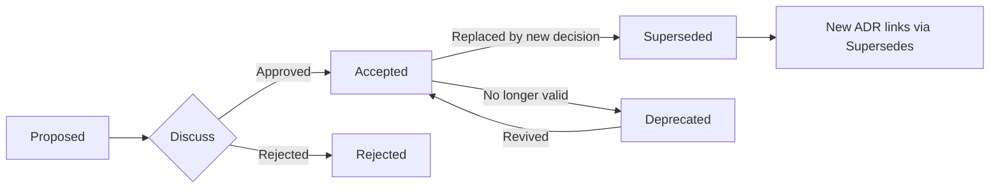
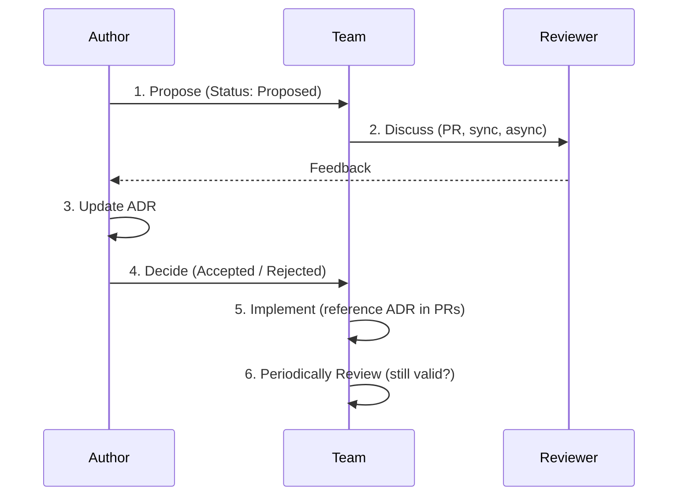

# Technical Documentation Pipeline and Template Generation

Process technical prompts, determine the correct phase of the engineering lifecycle, and generate structured documentation adhering to these platform boundaries:
1. **Architecture Decision Records (ADRs)** → Redmine (basic Markdown, textile-friendly)
2. **Technical Design Documents (TDDs)** → Notion (rich Markdown with code blocks, tables, blockquotes)

## Reference Files — Load on Demand

- `references/adr-template.md` — full ADR template with Mermaid diagrams, lifecycle, and anti-patterns. Load before drafting any ADR.
- `references/design-doc-template.md` — full Design Doc template with Mermaid diagrams. Load before drafting any Design Doc.

## 1. Pipeline Sequencing

| Signal | Sequence | Output |
|--------|----------|--------|
| Solving a system constraint or bottleneck | A (Foundation First) | ADR to lock in the technology choice |
| Building a new pipeline, API, or feature | B (Feature First) | Design Doc; flag architectural forks for a separate ADR |
| Both "why we chose it" and "how to build it" | Split | ADR first, visual divider, then Design Doc |

## 2. When to Write an ADR

### Write
- Choosing between significant alternatives (databases, frameworks, patterns)
- Decisions that would be expensive to reverse
- Establishing patterns or conventions the team should follow
- Deciding NOT to do something (document why)
- A future developer will ask "why did we do this?"

### Skip
- Decision is easily reversible
- Standard/obvious choice for the situation
- Already documented elsewhere (RFC, design doc)
- Personal preference with no significant impact

## 3. ADR Lifecycle



### Status Transitions

| Status | Meaning |
|--------|---------|
| **Proposed** | Draft, under discussion |
| **Accepted** | Decision agreed, actionable |
| **Rejected** | Considered and declined — keep for posterity |
| **Deprecated** | Decision no longer valid, no direct replacement |
| **Superseded** | Replaced by a newer ADR (links to it) |

### Superseding

When a new decision replaces an old one, the new ADR declares it in its header, and the original ADR's status updates:

```
# ADR-010: Use Prisma Instead of TypeORM
**Status:** Accepted (Supersedes ADR-003)

# ADR-003: Use TypeORM for Database Access
**Status:** Superseded by ADR-010
```

## 4. ADR Organization

### Numbering

- Zero-padded for sorting: `0001`, `0042`, `0123`
- Never reuse numbers
- Gaps are okay (deleted/rejected ADRs)

### Directory Structure

```
docs/adr/
├── README.md
├── 0001-use-postgresql.md
├── 0002-rest-api.md
├── 0003-auth0-migration.md
└── template.md
```

### Index File

```
# Architecture Decision Records

| ADR | Title | Status | Date |
|-----|-------|--------|------|
| [001](0001-use-postgresql.md) | Use PostgreSQL | Accepted | 2024-01-15 |
| [002](0002-rest-api.md) | REST API Strategy | Accepted | 2024-01-20 |
```

## 5. ADR Workflow



1. **Propose** — Create ADR in `Proposed` status, share with team
2. **Discuss** — Review via PR, architecture meeting, or async. Update based on feedback
3. **Decide** — Update status to `Accepted` or `Rejected`. If rejected, document why
4. **Implement** — Reference ADR in implementation PRs: `Implements ADR-003: Auth0 Migration`
5. **Review** — Periodically check: still valid? Should any be deprecated?

## 6. Redmine ADR Protocol (The "Why")

**Trigger:** Comparisons, framework selections, or foundational shifts.
**Format:** Basic Markdown (Redmine textile-friendly). No nested HTML.
**Template:** Load `assets/adr-template.md`

### Writing Tips

**Context section** — facts not opinions, include constraints explicitly, mention stakeholders, reference related docs.

**Decision section** — active voice ("We will use..." not "It was decided..."), be specific and unambiguous, include scope.

**Consequences section** — honest about tradeoffs, don't hide negatives, include operational impact, consider future.

**One decision per ADR** — avoid bundling related decisions, link to related ADRs.

### Lightweight Format

For smaller decisions:

```markdown
# ADR-NNN: Title
**Status:** Accepted | **Date:** YYYY-MM-DD

## Context
Brief description.

## Decision
What we decided.

## Consequences
Key outcomes.
```

### Anti-Patterns

| ❌ Vague | ✅ Specific |
|----------|-------------|
| "We'll use a modern database." | "Use PostgreSQL 15 on AWS RDS Multi-AZ." |
| Decision section is a paragraph of backstory | Decision states the choice in one clear sentence |
| Consequences just say "more flexibility" | Consequences enumerate specific wins and tradeoffs |
| Context lists opinions | Context states constraints and forces |

## 7. Notion Design Doc Protocol (The "How")

**Trigger:** System design, rollout plans, API definitions, or pipeline construction.
**Format:** Rich Markdown (code blocks, tables, blockquotes).
**Template:** Load `assets/design-doc-template.md`

## 8. Pre-Flight Check

Before delivering output, verify:
- [ ] Template chosen matches the request type (ADR vs Design Doc vs Split)
- [ ] ADR follows MADR standard with lifecycle status
- [ ] Numbering follows zero-padded convention
- [ ] Supersedes/Superseded-by links are correct if replacing an old decision
- [ ] All sections present — none skipped or summarized
- [ ] Placeholders replaced with concrete, realistic technical details
- [ ] Platform boundary respected: ADR → Redmine, Design Doc → Notion
- [ ] Split output has a visual divider between the two documents
- [ ] Mermaid diagrams included and relevant to the content
- [ ] No anti-patterns (vague language, missing context, bundled decisions)
