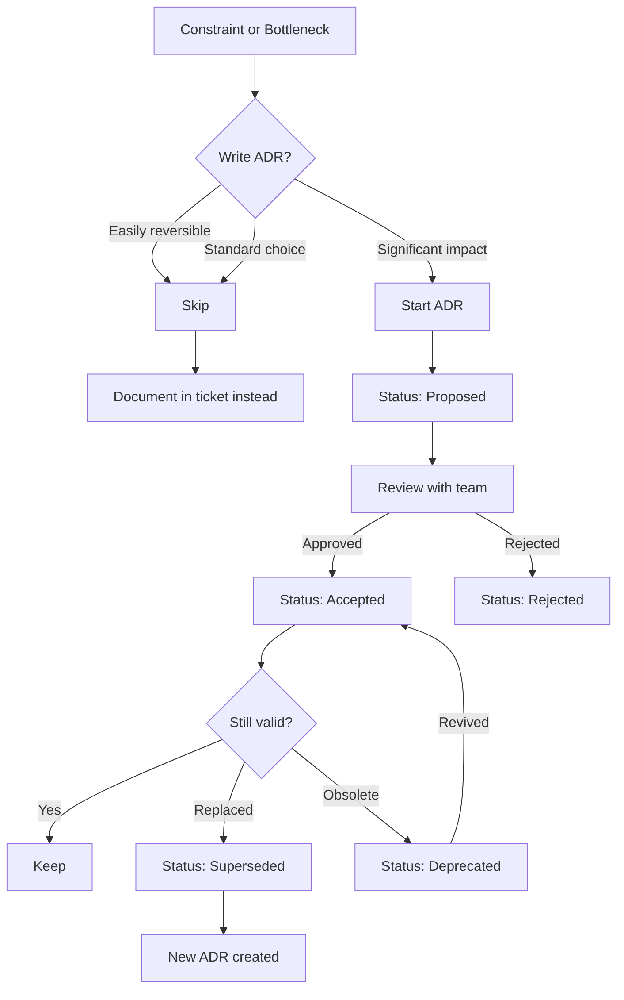
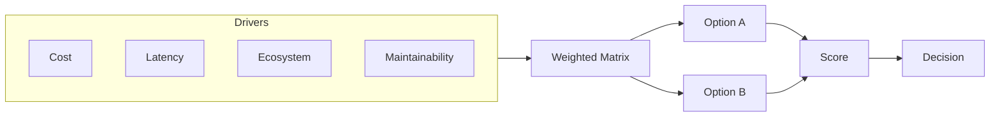

# ADR Template — Redmine

## Decision Flow





---

# ADR-NNNN: [Title]

**Status:** [Proposed | Accepted | Deprecated | Superseded by ADR-NNNN]
**Date:** [YYYY-MM-DD]

## Context

What is the issue motivating this decision? What forces are at play — technical, constraints, tradeoffs? What stakeholders are involved? State facts, not opinions.

## Decision

What we are doing. Active voice ("We will use..." not "It was decided..."). Be specific — name versions, platforms, configurations.

## Consequences

### Positive
- [Benefit 1]
- [Benefit 2]

### Negative
- [Tradeoff 1]
- [Tradeoff 2]

### Neutral
- [Side effect neither good nor bad]

```mermaid
quadrantChart
    title Consequence Impact Assessment
    x-axis Low Effort --> High Effort
    y-axis Low Value --> High Value
    quadrant-1 "Major Wins"
    quadrant-2 "Quick Wins"
    quadrant-3 "Low Priority"
    quadrant-4 "Acceptable Cost"
    [Consequence]: [0.x, 0.y]
```

## Alternatives Considered

### [Alternative 1]
[Why it was considered, why it was rejected — specific technical reasons.]

### [Alternative 2]
[Why it was considered, why it was rejected — specific technical reasons.]

---

```mermaid
gantt
    title Adoption Timeline
    dateFormat YYYY-MM-DD
    section Review
    ADR Draft         :a1, [YYYY-MM-DD], 3d
    Team Review        :a2, after a1, 2d
    Decision           :milestone, after a2, 0d
    section Execution
    Phase 1           :b1, after a2, 5d
    Phase 2           :b2, after b1, 5d
    Done               :milestone, after b2, 0d
```

## Links

- **Related ADRs:** [ADR-NNNN]
- **Implementation PR:** [#NNNN]
- **Discussion:** [link]

---

## Alternative: MADR Format

If the team prefers the MADR standard (more structured for complex decisions):

```markdown
# ADR-NNNN: [Title]
**Status:** [Proposed | Accepted | Deprecated | Superseded by ADR-NNNN]
**Date:** [YYYY-MM-DD]

## Context and Problem Statement
[The technical constraint driving this decision.]

## Decision Drivers
| Driver | Impact | Urgency |
|--------|--------|---------|
| [Driver 1] | High | High |

## Considered Options
- Option A: [description]
- Option B: [description]

## Decision Outcome
**Chosen:** [Option A], because [primary justification].

### Positive Consequences
- [Benefit]

### Negative Consequences
- [Tradeoff]

## Pros and Cons of the Options
### Option A
| Good | Bad |
|------|-----|
| [pro] | [con] |
```

### MADR Trigger
Use MADR when the decision has 3+ alternatives, weighted drivers, or a formal comparison matrix is needed. Otherwise, use the classic format above.

## Lightweight Format

For small, low-risk decisions:

```markdown
# ADR-NNN: Title
**Status:** Accepted | **Date:** YYYY-MM-DD

## Context
Brief description.

## Decision
What we decided.

## Consequences
Key outcomes.
```

## Anti-Pattern Checklist

| ❌ Anti-Pattern | ✅ Fix |
|-----------------|--------|
| "We'll use a modern database." | Name specific technology and version |
| Decision is a paragraph of backstory | One clear sentence stating the choice |
| Consequences only say "more flexibility" | Specific wins AND tradeoffs |
| Context is opinions | Constraints and forces |
| Multiple decisions bundled | Split, link between ADRs |
| No supersedes link when replacing | Add `Supersedes ADR-NNN` |
