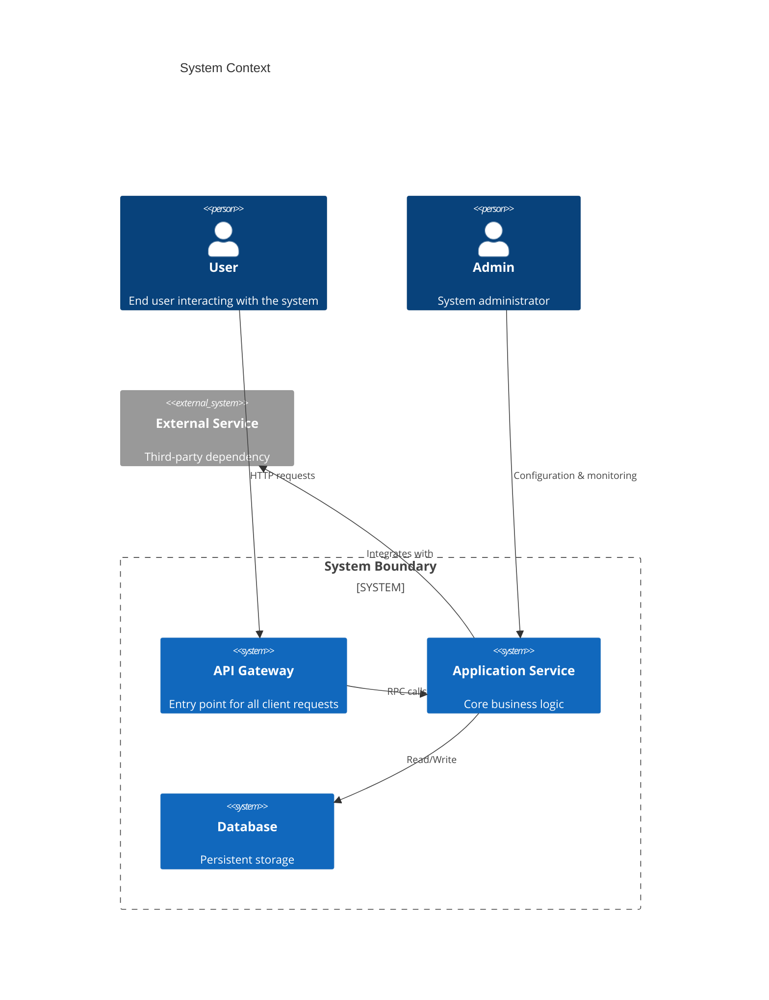
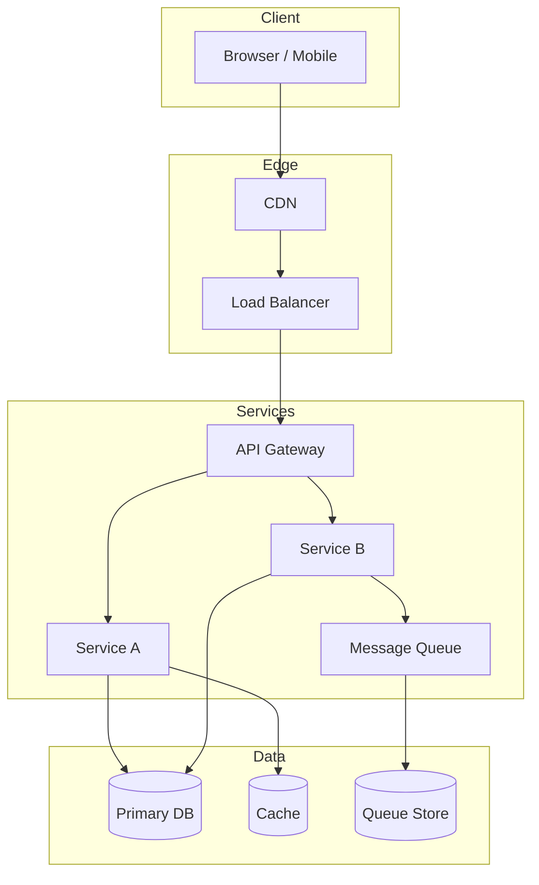
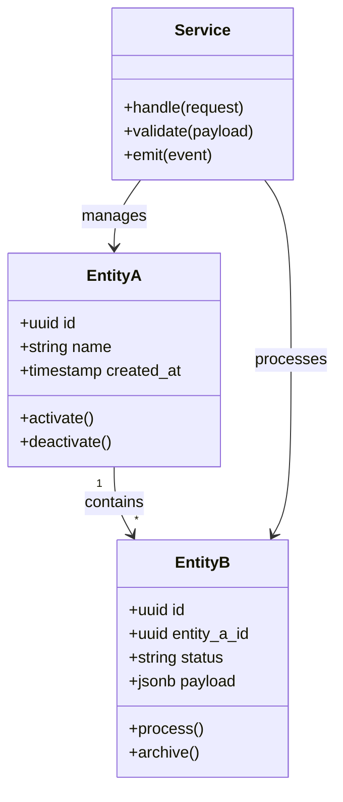
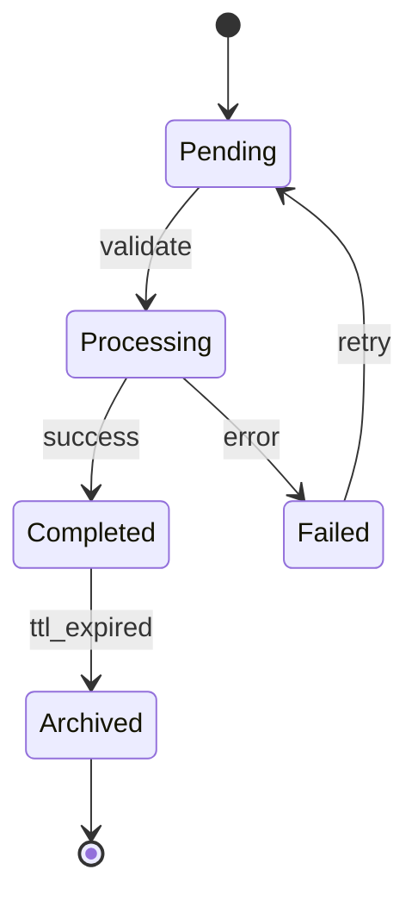
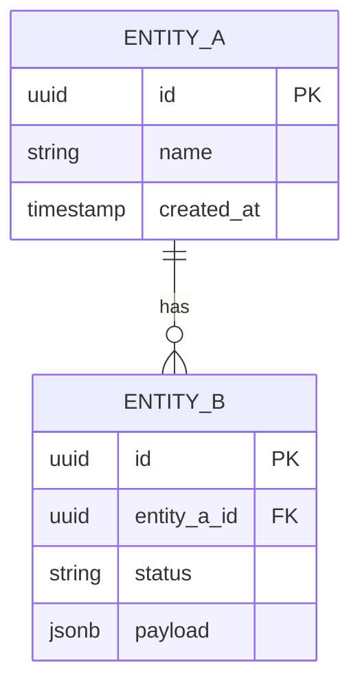
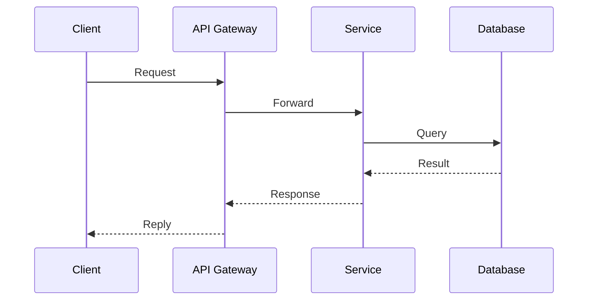
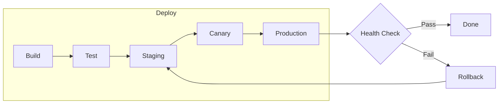
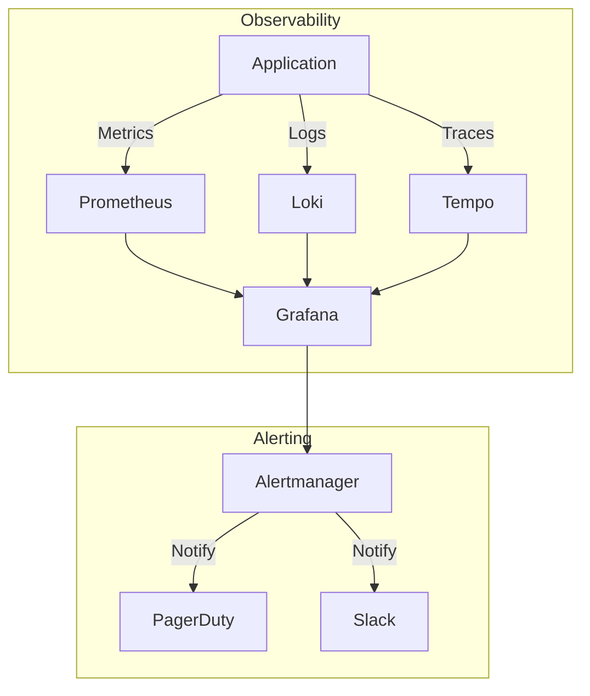

# Design Doc Template — Notion



---

# Design Doc: [System/Feature Name]

**Status:** [Draft | In Review | Approved]
**Related ADRs:** [Link to Redmine]

---

## 1. Context & Scope

[Technical requirement and business value — one paragraph.]

## 2. Goals & Non-Goals

### Goals

- [Target 1]
- [Target 2]

### Non-Goals

- [Explicit out-of-scope item 1]
- [Explicit out-of-scope item 2]

## 3. System Architecture



[Explain component interactions; embed a diagram here or reference the one above.]

### 4.1 Domain Model





### 4.2 Data Models & Schemas



[Fenced code block for schemas]

```json
{
  "EntityA": {
    "id": "uuid",
    "name": "string",
    "created_at": "timestamp"
  },
  "EntityB": {
    "id": "uuid",
    "entity_a_id": "uuid",
    "status": "string",
    "payload": "object"
  }
}
```

### 4.2 Endpoints / RPCs

| Endpoint | Method | Purpose |
| :--- | :--- | :--- |
| [Endpoint Path] | [HTTP Method] | [Description] |



## 5. Infrastructure & Compute

- **Compute:** [Compute node or job requirements]
- **Storage:** [Storage and IOPS requirements]
- **Algorithm Complexity:** [Big O for core processing logic]



## 6. Observability & Security

- **Metrics & Logs:** [Observability stack integration details]
- **Security:** [Access controls and encryption]



## 7. Rollout Plan

1. [Phase 1 step]
2. [Phase 2 step]
3. **Rollback condition:** [Metric threshold triggering a revert]

```mermaid
gantt
    title Rollout Schedule
    dateFormat YYYY-MM-DD
    section Phase 1
    Deploy to Staging        :p1a, [YYYY-MM-DD], 2d
    Smoke Tests              :p1b, after p1a, 1d
    section Phase 2
    Canary 10%               :p2a, after p1b, 2d
    Monitor & Validate       :p2b, after p2a, 1d
    section Phase 3
    Gradual Rollout 50%      :p3a, after p2b, 2d
    Full Rollout 100%        :p3b, after p3a, 2d
    Rollback Window          :crit, after p3a, 3d
```
