# Contributing to PiglorOS

Thank you for contributing. PiglorOS is a Rust workspace with a deliberately
strict, hosted CI process. Keep changes focused, preserve the project
vocabulary in [`CONTEXT.md`](CONTEXT.md), and use the repository's existing
tools and policy checks before adding new automation.

The shortest path from a fresh checkout to a reviewable pull request is:

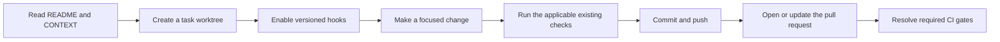

## Start with the repository guidance

Read these files before making a change:

- [`README.md`](README.md) — project overview, workspace layout, and common commands.
- [`CONTEXT.md`](CONTEXT.md) — domain vocabulary and current product boundaries.
- [`AGENTS.md`](AGENTS.md) — worktree, tracker, coverage, and quality-gate rules.
- [`docs/test-policy.md`](docs/test-policy.md) — test, coverage, and change-risk policy.

Keep current contributor instructions in Git. Dated plans, execution notes,
and architectural decisions belong in the linked Redmine or Notion records,
not in a second copy of this guide.

## Set up an isolated worktree

The project uses one worktree per task. Do not make task changes directly on
`main`.

```bash
git fetch origin main
git worktree add ../pigloros-<task-name> -b <branch-name> origin/main
cd ../pigloros-<task-name>

# Enable the versioned pre-commit hook once per clone.
git config core.hooksPath .githooks

rustup show active-toolchain
```

The toolchain is pinned in `rust-toolchain.toml` and currently requires Rust
1.97.1 with rustfmt, clippy, and llvm-tools-preview. Keep secrets outside
version control; for example, verify private files with:

```bash
git check-ignore -- .secrets/ledger.key
```

The local hook is an early feedback mechanism. It does not replace the
hosted required checks.

## Make a focused change

Before editing, classify the change and identify its public seam. New crates,
plugins, binaries, durable public APIs, storage or security boundaries,
protocols, and coordinate models require an accepted ADR before implementation.
Tests should exercise public interfaces rather than implementation details.

Use the existing repository commands and policy tools. A one-off script that
duplicates a tool's coverage, lint, or policy behavior is not a substitute for
the configured gate.

The normal local entry point is:

```bash
./scripts/ci.sh
```

For a pull request, the coverage diff can be evaluated against the exact base
commit:

```bash
DIFF_COVERAGE_BASE=<pull-request-base-sha> ./scripts/ci.sh
```

The individual commands are also useful while iterating:

```bash
cargo fmt --all -- --check
cargo test --workspace --all-features --locked -- --include-ignored
cargo clippy --workspace --all-features --all-targets --locked -- \
  -D warnings -W clippy::pedantic
RUSTC_BOOTSTRAP=1 cargo llvm-cov --workspace --all-features --locked \
  --summary-only --fail-under-lines 99 --fail-under-regions 99 \
  -- --include-ignored
```

See [`docs/test-policy.md`](docs/test-policy.md) for the rules behind these
commands. In particular, ignored tests must run, `coverage(off)` is test-only,
rustdoc `ignore` fences are not allowed, and production code must not be
exempted merely to satisfy coverage.

## How CI chooses its scope

The main CI workflow runs for pull requests, pushes to `main`, and manual
dispatches. Pull requests first run `ci_change_scope`. The trusted base
revision provides `.github/rust-scope.yml`, which keeps the decision about
whether a change affects Rust code out of the pull request's untrusted edits.

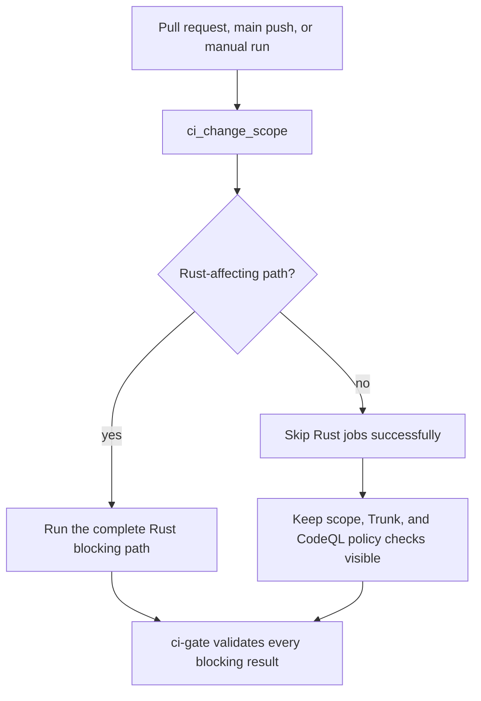

The documentation-only allowlist currently covers Markdown, MDX, AsciiDoc,
reStructuredText, `.agents/**`, and `docs/**`. Rust source, Cargo manifests,
the lockfile, toolchain files, scripts, workflows, fixtures, and unknown paths
are treated conservatively as Rust-affecting. A policy or workflow change
should therefore be expected to run the full gate set.

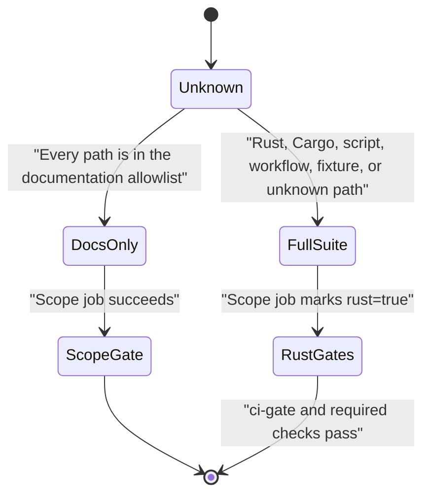

## Required CI sequence

CI is deliberately staged. A broken pull request receives useful feedback
before it can occupy the expensive runners, and the main staged workflow uses
no more than eight heavy runners at once.

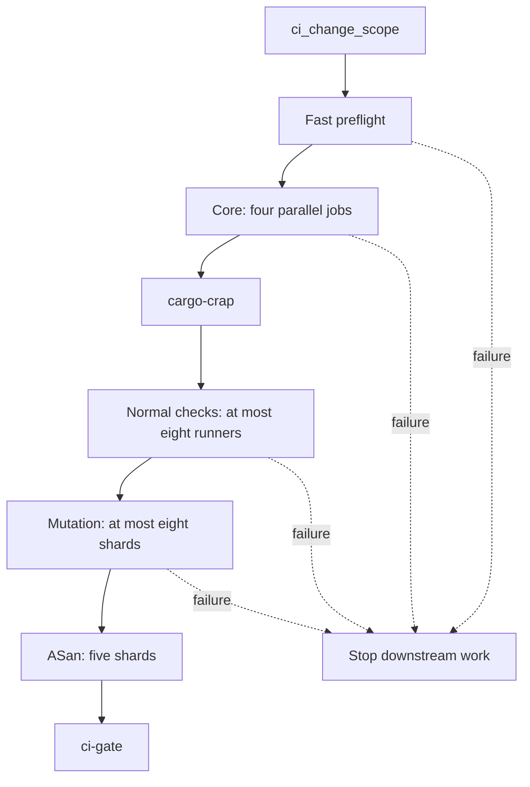

### Stage 1: fast preflight

Pull requests run Trunk in its native diff mode before Cargo-heavy work. The
same stage validates pinned workflow dependencies and the Linux/non-Linux
conformance boundaries.

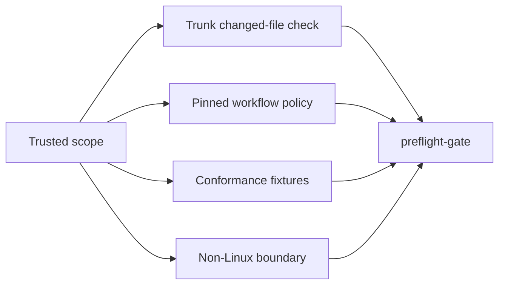

The standalone `trunk-check.yml` workflow performs the full-repository Trunk
audit on `main` and on schedule. It does not duplicate the pull-request diff
check.

### Stage 2: core quality gates

After preflight, the four core jobs start together:

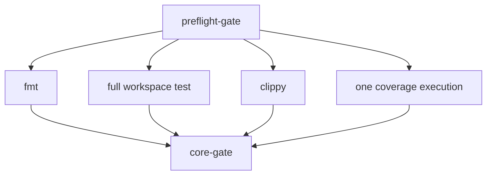

The core checks and their immediate cargo-crap consumer mean:

1. `fmt` runs `cargo fmt --all -- --check`.
2. `test` checks the workspace with default features disabled and all
   features enabled, then runs all tests with `--include-ignored`. The test
   gate is workspace-wide; Cargo has no built-in changed-test selector.
3. `clippy` runs all targets with warnings denied and the repository's
   pedantic policy.
4. `coverage` performs one complete `cargo llvm-cov` run. `covgate` checks
   changed production Rust code first from that report, then the same report
   is checked against the full workspace 99% line and 99% region floor. The
   resulting LCOV is uploaded for the next gate.
5. `cargo-crap` consumes that LCOV and a trusted baseline. Existing function
   scores may not regress, and new functions must score at most 30.

There is no custom changed-test mapper. Cargo and nextest do not provide a
reliable affected-test mapping for this workspace, so the complete test suite
runs once. Coverage still checks changed production code first without a
second instrumented execution:

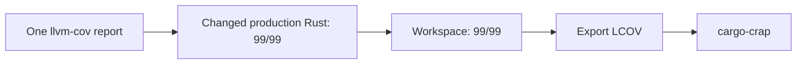

### Stage 3: normal checks

`cargo-crap` starts only after every core job passes. Its success releases the
normal checks. Audit, deny, and shear share one runner; browser parity replaces
the completed WASM packaging job rather than adding another concurrent runner.
CodeQL is called from this stage instead of starting independently on every PR.

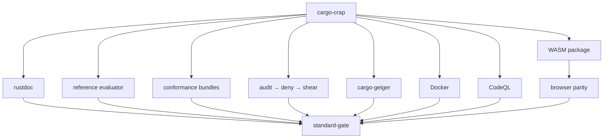

`modules-structure` and `depgraph` are reporting-only jobs. They run after a
successful normal stage on `main`, not on pull requests.

### Stages 4 and 5: mutation, then ASan

Mutation and ASan cannot begin until every cheaper blocking gate passes.
Mutation is changed-line scoped and uses at most eight shards. It skips its own
workspace baseline because the identical stable full-workspace test command has
already passed in the core stage.

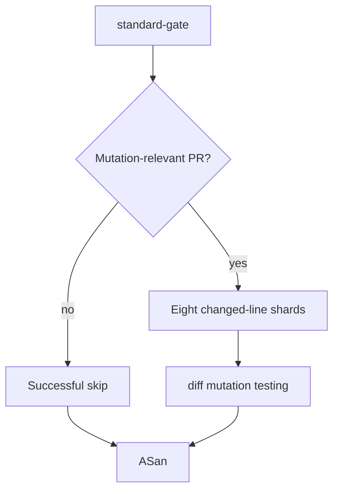

ASan remains final. The previously dominant `bundle_contract_public` target is
split through nextest's native `slice:1/2` partitioning; the other test groups
remain unchanged.

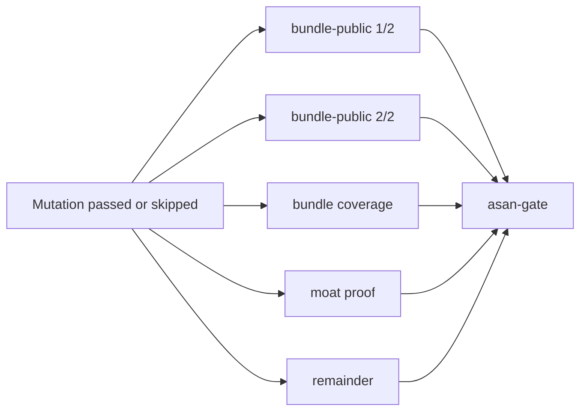

All features, ignored tests, sanitizer instrumentation, leak detection, and the
negative leak control remain required. Partitioning changes wall-clock time,
not scope.

The `ci-gate` job is the single blocking fan-in for the main CI workflow.
Individual jobs are implementation details; branch protection should require
the aggregate check.

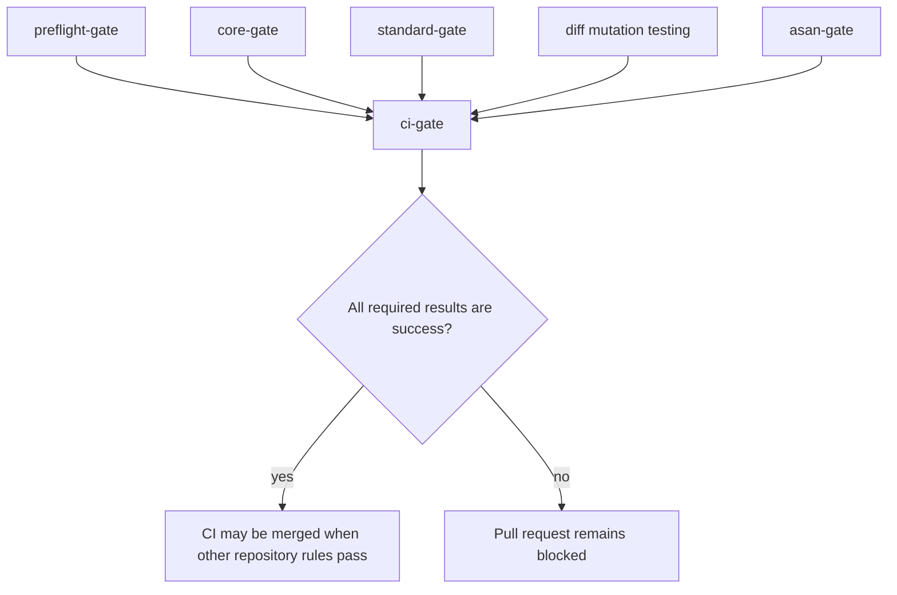

## Other workflows

The repository also has separate workflows for concerns that should not make
every pull request wait for a full stable-CI run:

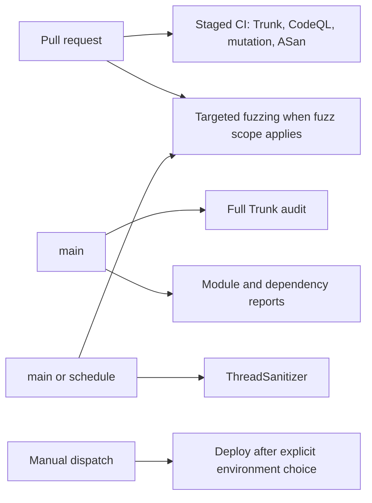

Fuzzing, ThreadSanitizer, and deploy retain their own triggers and policies;
inspect their workflow files when a change touches those boundaries.

## Pull request checklist

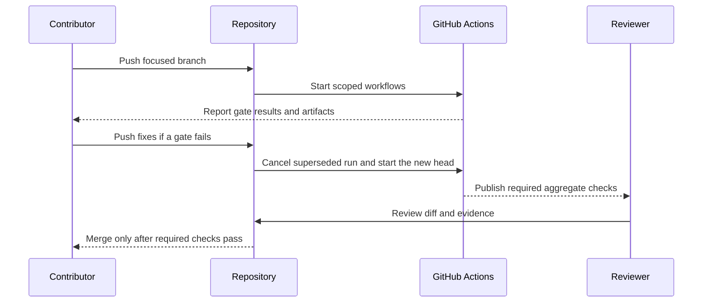

Before requesting review, confirm:

- the change is on a task worktree and the branch is based on current `main`;
- the diff is focused and does not include secrets, generated noise, or
  unrelated formatting;
- public terminology matches [`CONTEXT.md`](CONTEXT.md);
- tests use public seams and ignored tests are not used to hide failures;
- documentation-only changes stay within the documentation scope when that is
  intentional;
- Rust-affecting changes include the relevant test, coverage, and policy
  evidence; and
- the pull request description explains any hosted-only or resource-dependent
  validation and links to the relevant artifacts.

When a hosted gate fails, fix the earliest meaningful failure first. Read the
job log and uploaded artifact before changing timeouts, shard counts, or
thresholds. A retry is useful for a known transient runner failure; it is not
evidence that a product or policy failure is resolved.

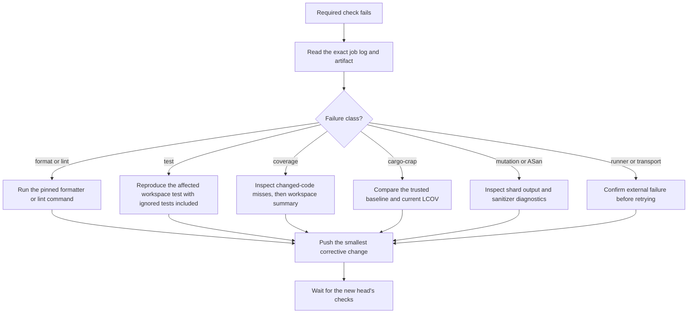

For the complete policy, including coverage attribution, trusted cargo-crap
baselines, hardware-dependent startup, and ASan scope, see
[`docs/test-policy.md`](docs/test-policy.md).
