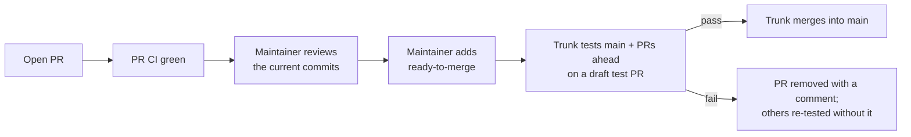

# Merging through the merge queue

Every change reaches `main` through [Trunk Merge Queue](https://docs.trunk.io/merge-queue).
The queue tests each pull request on top of the latest `main` **plus every
pull request queued ahead of it**, and merges exactly what it tested. Authors
never update branches to "catch up" with `main`, and parallel streams of work
no longer re-run each other's CI. The decision record is ADR-111 on the Redmine
wiki ([#476](https://redmine.piglor.com/issues/476)).

## Merging a pull request

1. Open the pull request against `main` and let its CI run.
2. A maintainer reviews the changes, including their own.
3. The maintainer adds the **`ready-to-merge`** label. That label is the only
   way into the queue; `/trunk merge` comments are switched off (see
   [Who can merge](#who-can-merge)). You may add it before CI finishes; Trunk
   waits until GitHub reports the pull request as mergeable.
4. Wait. Trunk posts its status on the pull request and merges when the queue
   test passes.

Removing the label, or cancelling in the Trunk web app, takes the pull request
out of the queue.

Do **not**:

- press GitHub's Merge button or call the merge API — the `main -> queue only`
  ruleset rejects it, and any merge outside the queue resets every queued
  test;
- rebase or "Update branch" only because `main` moved — the queue already tests
  on top of the latest `main`. Update a branch only to resolve a **merge
  conflict**, which the queue cannot do for you;
- cancel and re-submit a pull request whose test was reset — Trunk restarts it
  automatically and re-submitting moves it to the back of the queue.

## Who can merge

Merging is a maintainer decision, not a CI check. Nothing in the repository's
workflows approves or blocks a pull request for its author; the queue entry
point is restricted instead:

- **Trunk GitHub commands are disabled**, so a `/trunk merge` comment from
  anyone does nothing.
- **Trunk enqueues on the `ready-to-merge` label.** GitHub lets only users
  with triage, write, maintain or admin access, and installed GitHub Apps,
  add labels. Contributors working from forks cannot.
- The only collaborator is the maintainer (`arceushui`). Give a new
  collaborator triage access or above only if they should be able to merge.
- Do not configure Dependabot or any other app to add `ready-to-merge`.
  Dependabot pull requests merge like any other: review, then add the label.

A new push to a queued pull request cancels it in Trunk ("PR pushed to"). If
an author pushes after you labelled the pull request, remove the label, review
the new commits, and add it again.

## Stacked pull requests

Trunk supports [GitHub stacked pull requests](https://docs.github.com/en/pull-requests/get-started/about-stacked-prs):
labelling a pull request in a stack tests that pull request and every pull
request below it in one CI run and merges them together.

If Trunk replies that the pull request "is not part of a stack that targets a
branch with a Merge Queue" for a real GitHub stack, merge the bottom pull
request (the one targeting `main`) through the queue first and continue
upwards as GitHub retargets each pull request, and report the stack to Trunk
support.

## When a queued pull request fails or waits

Trunk's comment on the pull request names the failing required check; open the
linked job log before changing anything.

| Symptom | Usual cause | Action |
|---|---|---|
| "Waiting to enter queue" / **Not Ready** | The pull request's own required checks are red or pending, or it has merge conflicts | Fix or re-run the failing check; resolve conflicts by merging `main` into the branch |
| Labelled pull request never enters the queue | Label enqueueing is off in Trunk, or the label name does not match | Check Trunk's label setting (see [Repository configuration](#repository-configuration)), then remove and re-add the label |
| "target branch (`main`) was updated outside of the merge queue" | Something merged without the queue | Nothing; Trunk restarts the affected tests |
| `cargo-crap` fails at "Resolve trusted cargo-crap baseline" right after `main` changed | `main`'s own CI has not yet uploaded the baseline for the new commit; Rust changes fail closed rather than self-baseline | Wait for `main`'s `ci` run to finish; Trunk re-tests, or remove and re-add the label afterwards |
| "Waiting for tests to start on a bisection of its batch" | A batch failed and Trunk is isolating the culprit | Nothing; pull requests that pass re-enter the queue |
| Every gate fails within seconds after a scope step error | GitHub's changed-file API was unavailable; the scope jobs fall back to the full gate set, so a repeat means a different problem | Read the scope job log |
| `CodeQL (Rust)` reports "analyses from advanced configurations cannot be processed when the default setup is enabled" | CodeQL **default setup** was enabled for the repository | Settings → Advanced Security → CodeQL analysis → **Switch to advanced** |
| Queue test pull request has no CI at all | The `ci` workflow is disabled | Actions → `ci` → **Enable workflow** |
| `github-advanced-security` fails with "requested model is not supported" | The optional Copilot code-scanning AI findings agent | Not a required check; ignore or disable it |

"Flaky" is not a diagnosis: a retry is reasonable only for a confirmed
infrastructure failure, and a second identical failure is real.

## Repository configuration

For maintainers changing settings; everything above works without touching
these.

- **Trunk:** one queue on `main` (`app.trunk.io`, organization `piglor`) in
  Draft PR mode, so the existing `pull_request` CI runs on Trunk's
  `trunk-merge/*` test pull requests without workflow changes.
- **Rulesets on `main`:**
  - `main -> queue only` — restrict updates, deletions and force pushes; the
    Trunk GitHub App is the only bypass actor, as **Exempt**. Adding a person
    to this bypass list lets merges skip the queue and reset it.
  - `Require Rust quality gates` — required checks `ci-gate`,
    `diff mutation testing`, `Trunk Code Quality` and `CodeQL (Rust)`;
    "require branches to be up to date" stays **off**.
  - `main` — pull request required (0 approvals), resolved conversations,
    linear history, CodeQL alerts block.
- Trunk must not bypass the two mergeability rulesets: they decide when a pull
  request may enter the queue.
- Keep Trunk's merge method compatible with linear history (squash or rebase).
- **Trunk merge queue settings:** **GitHub commands** disabled (no
  `/trunk` comment commands); label enqueueing enabled with the label
  `ready-to-merge`. GitHub comments and statuses can stay enabled.
- **Label:** create the `ready-to-merge` label once (Issues → Labels).
